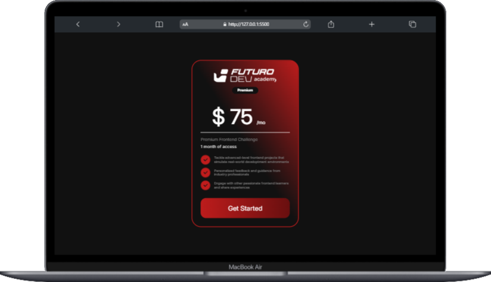
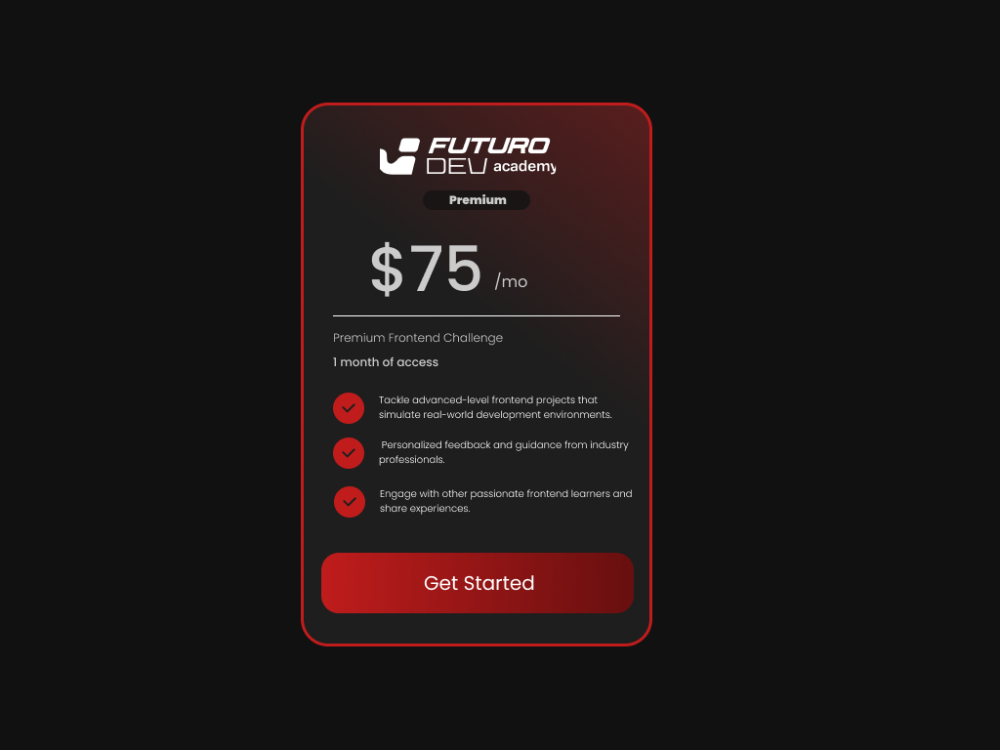

# 💻 Premium Plan Card – Futuro Dev Academy

Este é um projeto de uma **Página de Inscrição para um Plano Premium**, criado como desafio de front-end. A proposta foi desenvolver um **card moderno**, com foco em **design responsivo** e **estética profissional**.

## 📸 Preview

### Versão Web (MacBook Air)

### Versão Mobile (iPhone 14)

.png)

### Design Completo

---

## 🛠️ Tecnologias Utilizadas

- **HTML5**

- **CSS3**

- **Flexbox**

- **Media Queries (Responsividade)**

- **Gradientes com `linear-gradient`**

- Ícones PNG e tipografia moderna

---

## 🎯 Objetivo do Projeto

- Reproduzir um layout responsivo de um plano premium.

- Utilizar **CSS puro** para o design visual, sem bibliotecas externas.

- Praticar **alinhamentos com Flexbox** e **responsividade** com media queries.

- Criar uma **experiência visual coerente** em diferentes tamanhos de tela.

---

## 🧪 Funcionalidades

- Layout centralizado com **borda em gradiente vermelho**.

- Botão com **gradiente suave** e destaque visual.

- Alinhamento perfeito entre ícones e texto.

- Totalmente adaptado para **dispositivos móveis e desktops**.

---

## 📱 Responsividade

Este projeto foi testado e visualizado nas seguintes resoluções:

- 📱 iPhone 14 (390x844)
- 💻 MacBook Air (1440x900)
- 📐 Telas grandes e médias usando media queries

---

## 📂 Como visualizar localmente

1. Acesse o repositório no GitHub:

2. Acesse o site online:
